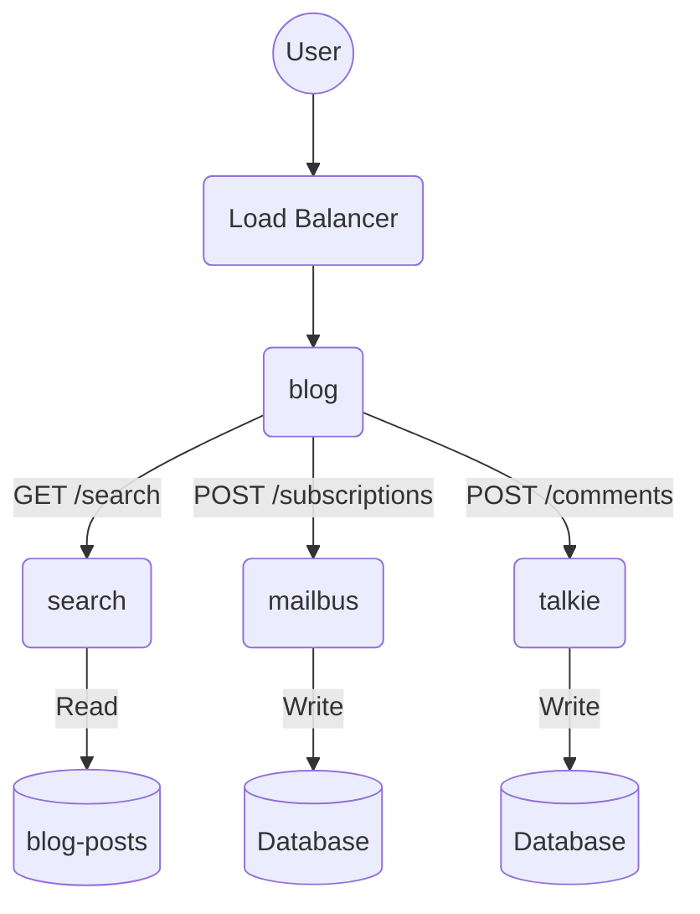
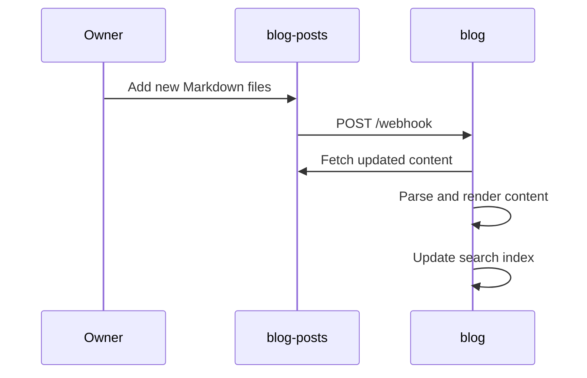

Source code for my blog at https://quantonganh.com

My passion for sharing knowledge led me to create my blog from the ground up. Writing about my experiences and discoveries in the world of programming became my integral part of my learning process. This journey has not only deepened my understanding of programming but also enabled me to contribute to the broader community by offering insights, solutions and inspiration. Remember, knowledge is a torch; the more you share it, the brighter it shines for others to follow.

# Blog

This service serves as the backbone in a microservices architecture, collaborating with various components:
- Content repository: https://github.com/quantonganh/blog-posts
- Email newsletter: https://github.com/quantonganh/mailbus
- Comment system: https://github.com/quantonganh/talkie

## API Design

- POST /webhook: handle incoming webhook events. It decodes the header, performs `git pull`, and triggers the content reload.
- GET /{year}/{month}/{day}/{postTitle}: get blog posts by year, month, day or specific one.
- GET /categories/{name}: get blog posts by specific category.
- GET [/tags](https://quantonganh.com/tags): list all tags and the number of blog posts for each tag.
- GET /tags/{name}: get blog posts by specific tag.
- GET /search?q={keywords}: search blog posts by keywords
- GET [/archives](https://quantonganh.com/archives): archived posts

## Data Structure

```go
type Post struct {
	ID          int
	URI         string
	Title       string
	Date        publishDate
	Description string
	Images      []string
	Content     template.HTML
	Summary     template.HTML
	Truncated   bool
	Categories  []string
	Tags        []string
	HasPrev     bool
	HasNext     bool
}
```

## High-level Design



## Sequence Diagram



- Install:

```shell
$ go get -v github.com/quantonganh/blog/cmd/blog
```

- Create a root directory for your blog:

```shell
$ mkdir -p some/dir
```

- Copy the HTML templates, assets:

```shell
$ cp -r /path/to/blog/http/html/templates some/dir/
$ cp -r /path/to/blog/http/assets some/dir/
```

- Create a `config.yaml` file in `some/dir`:

```yaml
templates:
  dir: templates
```

- Create your first blog post `test.md` in `some/dir/posts`:

```yaml
---
title: Test
date: Thu Sep 19 21:48:39 +07 2019
description: Just a test
tags:
  - test
---
Test.
```

- Run:

```shell
$ cd some/dir
$ /path/to/gopath/bin/blog
```

Then open a browser and access your blog at http://localhost.